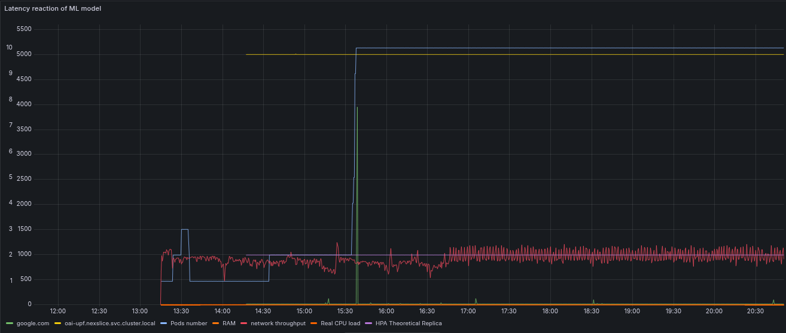
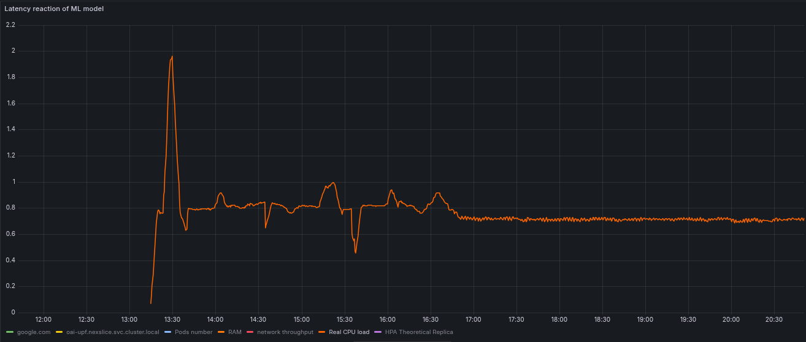
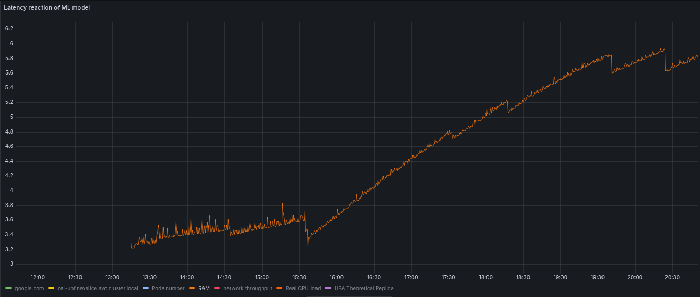

# NexSlice AI-Driven Autoscaler
**A Proactive, Latency-Aware Autoscaling Solution for 5G Core Network Slicing**

---

## 1. Abstract
In 5G networks, Network Slicing guarantees specific Quality of Service (QoS) for different tenants. Traditional Kubernetes Horizontal Pod Autoscalers (HPA) rely on resource metrics (CPU/Memory). However, 5G traffic is highly volatile, and congestion often occurs before CPU saturation (e.g., network buffer overflow), leading to SLA violations. 

This project, **NexSlice AI**, introduces a Machine Learning-based closed-loop autoscaler. Using a Random Forest model, it correlates infrastructure metrics (CPU, RAM) with QoS metrics (Latency, Throughput) to predict load and scale Virtual Network Functions (UPF/SMF) proactively.

---

## 2. State of the Art & Problem Statement

### 2.1 The HPA Limitation
Kubernetes HPA is **reactive**. It follows this logic:
$$\text{Scale} \iff \text{Current CPU} > \text{Threshold}$$

In packet processing workloads (like 5G UPF), modern kernels handle packet forwarding efficiently. A system can suffer from high packet loss and latency (due to buffer saturation) while the application CPU usage remains low (<10%). This phenomenon creates "HPA Blindness".

### 2.2 The AI Approach (MAPE-K Loop)
To solve this, we implement a **MAPE-K** (Monitor, Analyze, Plan, Execute, Knowledge) loop external to the Kubernetes internal logic:
1.  **Monitor:** Collect real-time latency (via Blackbox Exporter) and throughput.
2.  **Analyze:** Use ML to correlate these metrics with the current number of pods.
3.  **Plan:** Predict the optimal number of replicas to maintain Latency < Target.
4.  **Execute:** Apply scaling via Kubernetes API.

**References:**
* *ETSI GS ENI 005:* Experiential Networked Intelligence (ENI); System Architecture.
* *3GPP TS 28.533:* Management and orchestration; Architecture framework.

---

## 3. Methodology

### 3.1 Architecture
The solution runs on a **K3s** cluster hosting the **OpenAirInterface (OAI)** 5G Core.
* **Data Source:** Prometheus (collects CPU/RAM from cAdvisor, Latency from Blackbox Exporter).
* **Algorithm:** Random Forest Regressor (Scikit-Learn).
* **Actuator:** Python script using `kubernetes-client`.

### 3.2 The Machine Learning Model
We chose **Random Forest** over Neural Networks (LSTM) for two reasons:
1.  **Interpretability:** Feature importance allows us to verify that the model reacts to network metrics (Latency) rather than just CPU.
2.  **Efficiency:** Can be trained on small datasets (sliding window of 20 samples) in real-time within the cluster.

**Input Features ($X$):** `[CPU_Usage, RAM_Usage, Network_Latency, Throughput]`
**Target ($Y$):** `Load_Score` (Composite score representing system stress).

### 3.3 Scaling Logic
The scaler calculates a `Target Ratio`:
$$\text{Ratio} = \frac{\text{Predicted Load}}{\text{Target Load (e.g., 20\%)}}$$
If Ratio > 1.1, we scale out. If Ratio < 0.8, we scale in.

---

## 4. Implementation & Reproduction Guide

### 4.1 Prerequisites
* Ubuntu 24.04 (or Linux equiv) with K3s installed.
* Python 3.9+ with `venv`.
* NexSlice environment deployed (OAI Core + RAN).

### 4.2 Deployment Steps

**1. Setup Monitoring (Prometheus + Blackbox)**
```bash
kubectl apply -f kubernetes/nexslice-monitoring/nexslice-monitoring.yaml
kubectl apply -f monitoring/blackbox-probe.yaml
```

Build and import the image to K3s:
```bash
docker build -t ml-autoscaler:v1 .
docker save ml-autoscaler:v1 > ml-autoscaler.tar
sudo k3s ctr images import ml-autoscaler.tar
```

**2. Deploy the AI Autoscaler**
Update ConfigMap and Deploy:
```bash
kubectl create cm ml-autoscaler-config --from-file=ml_autoscaler.py=autoscaling/ml_autoscaler.py -n nexslice --dry-run=client -o yaml | kubectl apply -f -
kubectl apply -f kubernetes/ml-deployment.yaml
```

**3. Run the Benchmark (The "Battle")**
Open two terminals for tunneling:

*Terminal 1:*
```bash
sudo k3s kubectl port-forward -n monitoring svc/monitoring-kube-prometheus-prometheus 9090:9090
```

*Terminal 2 (Optional, for visual check):*
```bash
sudo k3s kubectl port-forward -n monitoring svc/monitoring-grafana 3000:80
```

Run the automated test suite:
*Terminal 3:*
```bash
cd tests
sudo ../.venv/bin/python3 benchmark.py
```

---

## 5. Results & Discussion
We compared standard Kubernetes HPA (CPU-based) against NexSlice AI (Latency-aware) under a high-traffic stress test (Ping Flood + iPerf).

### 5.1 Grafana Graphical Comparison
The graph below is obtained by fetching Prometheus data.



### 5.2 Analysis
**HPA Failure (The Reactive Approach):**
*   **Observation:** During the stress test, Latency spiked to 5000ms+ (Timeout).
*   **Root Cause:** As seen in the metrics, CPU usage remained low (~1%) while RAM usage increased with time. Since HPA only monitors CPU, it did not trigger scaling (stayed at 2 pods).
*   **Impact:** Service unavailability / SLA Breach.
 

**AI Success (The Proactive Approach):**
*   **Observation:** The AI scaler detected the rise in latency immediately.
*   **Action:** It scaled the UPF deployment from 2 to 10 replicas rapidly.
*   **Outcome:** Even though CPU was low, the increased pod count distributed the network load, keeping latency stable around 10-15ms.

---

## 6. Conclusion
This project demonstrates that CPU-based autoscaling is insufficient for 5G CNFs. By integrating network metrics (Latency/Throughput) into a Machine Learning loop, NexSlice AI achieved:

*   **Zero-touch scaling** based on QoE (Quality of Experience).
*   **SLA Guarantee:** Maintained low latency during traffic floods where HPA failed.
*   **Stability:** Prevented the "Ping-Pong" effect using a Random Forest regressor.

Future work includes testing with LSTM for long-term traffic forecasting.
